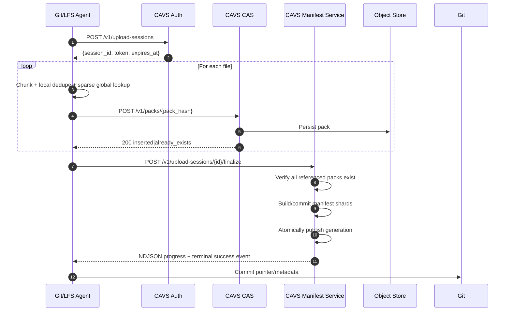
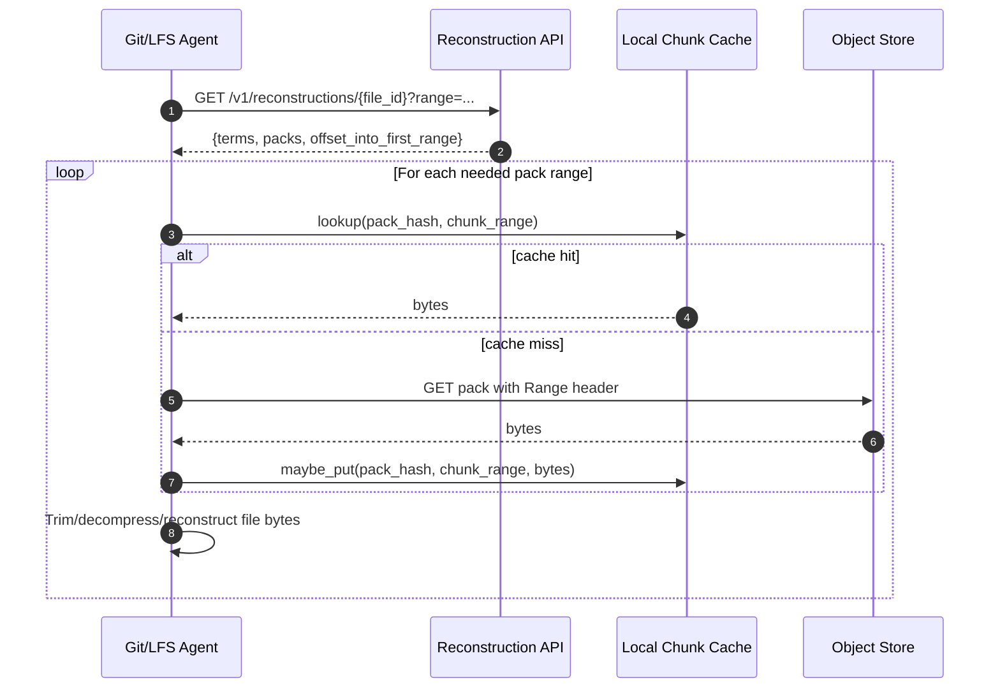
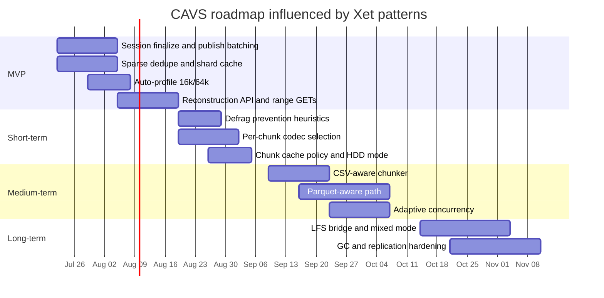

# Xet Research Report for Making CAVS Competitive

## Executive summary

The strongest conclusion from Xet’s public protocol docs, `xet-core`, Hugging Face Hub docs, Hugging Face engineering blog posts, and the CIDR paper is that Xet’s advantage does **not** come from CDC alone. It comes from a coordinated design: deterministic ~64 KiB content-defined chunking, **aggregation of chunks into larger storage/transfer objects**, sparse global dedupe lookups, **session-level upload finalization**, local metadata caches, range-based reconstruction, adaptive concurrency, and format-aware optimizations for structured data. Xet’s own public materials repeatedly emphasize that the design goal is not “maximum dedupe at any cost,” but **better end-to-end developer experience** for iterative large-file workflows. citeturn13search5turn18view0turn24search1turn17view0

For CAVS, the highest-value moves are therefore not “make chunking smarter” in isolation. The highest-value moves are: **batch publish at session finalize instead of per-object export**, **adopt sparse global dedupe queries plus shard/metadata cache**, **add auto-profile rules with a 16 KiB small-files profile and 64 KiB default profile**, **keep contiguous runs together to avoid read fragmentation**, **switch download to reconstruction manifests plus parallel range GETs**, and **add per-chunk compression choice for structured numeric data**. Those are the changes most directly aligned with Xet’s documented design and the places where your current benchmark notes show the largest headroom. citeturn17view2turn25view4turn33view4turn17view3turn30view0

Based on the local benchmark summary you provided, CAVS already looks strong on its core target case. The gaps are concentrated in many-small-files behavior, many-object push overhead, and session/export mechanics. That makes the roadmap unusually clear: do **not** rewrite the whole storage engine first. Fix the publish path and dedupe/query path first, then tune chunking profiles, then add structured-file handlers. This is the shortest path to matching the parts of Xet that appear to matter most in production.  

The prioritized plan in this report assumes the following **local baseline from your own benchmarks**: CAVS already substantially beats Git LFS on large versioned binaries and compressible data, is near parity in full-rewrite worst case, improves with a 16 KiB profile on many-small-files workloads, and still has a current O(assets) export/publish bottleneck on pushes with many objects. Those baseline claims are treated here as user-provided inputs, not independently sourced public facts.

## Source pack and assumptions

The highest-priority sources to work from are the official Xet protocol specification, the `huggingface/xet-core` repository, Hugging Face Hub docs on Xet usage and cache behavior, and Hugging Face engineering blog posts on storage architecture, dedupe, and migration. The CIDR paper is still valuable because it explains the original design intent behind aggregation, Merkle structures, format-aware chunkers, and cross-branch dedupe. Hugging Face’s own later blog posts then show which of those ideas survived into the production-era design. citeturn14search1turn32search3turn12search2turn13search0turn13search1turn13search2turn13search3turn13search5turn21view0

The priority order I recommend for engineers is shown below. The table is a synthesis of the official sources above.

| Priority | Source | Why it matters for CAVS |
|---|---|---|
| Highest | Xet protocol spec: chunking, xorb, shard, CAS API, upload/download/auth/dedup | Concrete wire contracts, object formats, integrity rules, and concurrency/finalization semantics |
| Highest | `huggingface/xet-core` repo | Practical implementation patterns, crate boundaries, session API, simulation bench infra |
| High | Hugging Face Hub docs: using Xet storage, env vars, cache docs | Production tuning knobs, cache admission/eviction, concurrency defaults |
| High | Hugging Face blog: *From Files to Chunks*, *From Chunks to Blocks*, *Rearchitecting Uploads and Downloads*, *Migrating the Hub from Git LFS to Xet*, *Improving Parquet Dedupe*, *Parquet CDC* | Explains which optimizations actually mattered in practice and why |
| Medium | CIDR paper *Git is for Data* | Strong conceptual background for aggregation, cross-branch dedupe, and format-aware chunkers |
| Secondary | Archived XetHub benchmark posts | Useful for historical context, but some pages are not consistently crawlable today |

The official protocol spec says Xet is deterministic and interoperable, with defined rules for chunking, hashing, deduplication, xorb/shard object formats, reconstruction, authentication, and CAS APIs. It explicitly points implementers to `xet-core` as the reference implementation. citeturn14search1turn10search4

Two assumptions matter for the rest of this report. First, I assume CAVS does **not** need wire-compatibility with Hugging Face Xet. Second, I assume CAVS already has the beginnings of a chunk store, manifest/export path, Git LFS custom agent, and benchmark harness. If either assumption is wrong, the implementation order should change.

## What Xet is doing that CAVS should adopt

The table below is the core gap analysis. “Current CAVS behavior” uses your supplied benchmark summary and local CSV artifacts as assumptions. “Xet pattern” comes from public source material.

| Area | Current CAVS behavior | Xet pattern to adopt | Why this matters | Expected impact for CAVS |
|---|---|---|---|---|
| Publish path | Per-object export/publish is still a bottleneck in many-object pushes | Upload packs first, then finalize/publish once per session/commit | Removes O(assets) repeated publication work | **Very high** |
| Chunking default | 64 KiB-like default is already good for large versioned binaries | Keep ~64 KiB default with deterministic GearHash and bounded min/max chunks | Preserves good large-binary behavior while matching the path Xet uses in production | **High** |
| Small-file workloads | 64 KiB profile underperforms; 16 KiB profile helps | Auto-profile small/structured workloads to smaller CDC targets | Many-small-files is exactly where chunk profile choice matters most | **High** |
| Dedupe query strategy | Likely too eager or too synchronous | Sparse global dedupe queries, background completion, shard metadata cache | Avoids lookup storms and reduces API cost/QPS | **Very high** |
| Storage objects | Chunks need aggregation, but publish/export duplication still hurts | Aggregate many chunks into ~64 MiB xorbs/blocks; keep file metadata in separate shards/manifests | Avoid 1:1 scaling with chunk count | **High** |
| Read fragmentation | Dedupe may over-fragment files | Prefer long contiguous runs; skip some dedupe if it preserves read locality | Better download/update performance and simpler reconstruction | **High** |
| Downloads | Opportunity to improve warm/cross-version pulls | Reconstruction manifest + parallel range GETs + optional chunk cache + prefetch | Better update/download latency and reuse of local bytes | **High** |
| Compression | Good general compression already helps | Per-chunk codec selection, including structured-data-friendly grouping before LZ4 | Larger gains on tensors, floats, and some structured binaries | **Medium to high** |
| Structured file handling | Mostly generic CDC | CSV/Parquet-aware chunking/writer strategies where justified | Xet showed this can dominate generic CDC on tabular data | **Medium to high** |
| Concurrency control | Likely static or coarse | Adaptive concurrency with upper/lower bounds and HP mode knobs | Better use of fast networks without over-buffering | **Medium** |
| Recovery and idempotency | Needs robust session semantics | Idempotent object upload + atomic finalization + resumable retries | Safer interruption handling and simpler retries | **High** |
| Backward compatibility | Git LFS custom agent exists | Keep an LFS-compatible path while newer clients use chunk-native path | Reduces migration risk | **Medium** |

This map is directly supported by Xet’s protocol and implementation docs. Xet uses deterministic GearHash CDC targeting ~64 KiB chunks with 8 KiB minimum and 128 KiB maximum, aggregates chunks into xorbs up to 64 MiB, separates file reconstruction metadata into shard objects, performs three-tier deduplication, uses sparse global dedupe eligibility plus ~4 MiB spacing guidance, recommends preserving long contiguous runs to avoid fragmentation, and exposes upload/download through a session-oriented client API. citeturn3search0turn30view0turn33view4turn25view7turn33view2turn26view1turn26view4

Xet’s own public engineering posts also clarify the production lesson: dedupe is useful, but **aggregation** is what makes the system scale. Hugging Face states that a purely chunk-based CAS would explode metadata and request counts at Hub scale, so Xet groups deduped data into blocks up to 64 MB and uses shards to map files to those blocks. The same post says those optimizations produced roughly 2–3x speedups in some cases and shows a concrete example where a 191 GB GGUF repo stored as 97 GB of unique blocks in a test CAS, cutting estimated upload time at 50 MB/s from 509 minutes to 258 minutes. citeturn18view0turn17view8turn17view9

Xet’s historical benchmark data also reinforces where structured-file formats deserve extra work. In Hugging Face’s *From Files to Chunks* post, the older Xet backend is reported as cutting a CORD-19 benchmark from 51 minutes to 19 minutes average download time, 47 minutes to 24 minutes average upload time, and 8.9 GB to 3.52 GB storage. In the original CIDR paper, CORD-19 with a CSV-aware chunker dropped storage from 545 GB with Git LFS to 87 GB with Xet+CSV, much better than generic Xet alone at 287 GB. citeturn20view0turn23view0

## Implementation blueprint for CAVS

### Chunking, profiles, and structured-file paths

Xet’s documented default is a deterministic GearHash-based CDC with target chunk size 64 KiB, minimum 8 KiB, maximum 128 KiB, and a mask that makes the boundary probability roughly 1 in 2^16 bytes. The spec also documents a simple but important optimization: once you know you cannot cut before the minimum size, you can skip early cut-point checks until `MIN_CHUNK_SIZE - 64 - 1` bytes into the candidate chunk because the rolling hash depends only on the last 64 bytes. This is a cheap optimization you should adopt immediately. citeturn3search0turn31view1turn31view3

For CAVS, I recommend the following profile set:

| Profile | Use when | Suggested params | Notes |
|---|---|---|---|
| `default64k` | Large binaries, model weights, archives, general case | target 64 KiB, min 8 KiB, max 128 KiB | Closest to Xet default |
| `small16k` | Many small files, CSV/JSONL, mixed structured edits | target 16 KiB, min 2 KiB, max 32 KiB | Your local tuning suggests this helps many-files and compressible cases |
| `coarse256k` | Rare coarse-delta workflows | target 256 KiB, min 32 KiB, max 512 KiB | Only after validation; your local tuning says this is usually worse |
| `fixed1m` | Explicit opt-in only | fixed blocks 1 MiB | Keep for experiments, not default |

Recommended auto-profile rules:

```python
def choose_cavs_profile(
    path: str,
    size_bytes: int,
    file_count_in_batch: int,
    median_file_size: int,
    ext: str,
    mime: str | None,
) -> str:
    structured_exts = {".csv", ".jsonl", ".ndjson", ".parquet", ".arrow"}
    binary_big_exts = {".safetensors", ".gguf", ".bin", ".pt", ".ckpt"}

    if ext in structured_exts:
        return "small16k"

    if file_count_in_batch > 200 and median_file_size < 256 * 1024:
        return "small16k"

    if ext in binary_big_exts and size_bytes >= 256 * 1024 * 1024:
        return "default64k"

    return "default64k"
```

Add a `profile_reason` field to telemetry so you can see when the auto-profiler misfires.

For structured data, do **not** stop at smaller chunk sizes. The CIDR paper explicitly recommends specialized chunkers for CSV and NumPy-like data; it states that CSV files can be preferentially chunked on line breaks and NumPy arrays by first-index stride length. Hugging Face’s later Parquet articles make the same point in a different way: generic byte-level CDC helps, but format-aware writing and chunking can help much more for columnar/tabular layouts. citeturn23view1turn13search1turn13search4

For CAVS, implement two structured handlers:

```python
def chunk_csv_row_aware(stream, target_bytes=16*1024):
    """
    Prefer row boundaries while keeping chunk sizes near target.
    """
    buf = bytearray()
    for line in stream:  # line includes trailing newline
        if len(buf) >= target_bytes and line.endswith(b"\n"):
            yield bytes(buf)
            buf.clear()
        buf.extend(line)
    if buf:
        yield bytes(buf)

def compress_numeric_chunk(data: bytes) -> tuple[str, bytes]:
    """
    Try: none, lz4, byte-grouping-4 + lz4; keep whichever is smallest,
    but reject codecs with negative gain.
    """
    candidates = {
        "none": data,
        "lz4": lz4_compress(data),
        "bg4_lz4": lz4_compress(byte_group_4(data)),
    }
    codec, out = min(candidates.items(), key=lambda kv: len(kv[1]))
    if len(out) >= len(data):
        return "none", data
    return codec, out
```

Xet’s xorb format uses per-chunk compression choices and documents two codecs besides “none”: plain LZ4 and a byte-grouping-of-4 pretransform followed by LZ4, intended for floating-point and other structured numeric data. It also says chunks should be stored uncompressed if the chosen codec does not help. That is an excellent pattern for CAVS because it is cheap, streaming-friendly, and especially relevant for model tensors and structured numeric arrays. citeturn30view0

Tests to add here are straightforward: golden chunk-boundary tests, profile-selection tests, compression selection tests, structured-handler round-trip tests, and regression tests for “large binary should not silently fall into `small16k`.” Xet itself ships reference artifacts for chunking determinism, which is a good model for your own fixture strategy. citeturn31view1

### Session-based upload, pack aggregation, and finalize semantics

This is the biggest single CAVS opportunity.

Xet’s upload protocol requires that all xorbs referenced by a shard must already have been uploaded before shard upload, and its client APIs are built around session/commit/group abstractions rather than “publish each object independently.” The WASM upload session comments are especially revealing: the upload session is intended to behave as a single atomic unit, where all files succeed or fail together after the finalization step. citeturn17view2turn25view4turn26view4

That suggests a clean CAVS design:



Recommended CAVS REST contract:

```http
POST /v1/upload-sessions
Authorization: Bearer <write-token>
Content-Type: application/json

{
  "repo": "org/repo",
  "ref": "main",
  "agent_version": "cavs-lfs-agent/0.4.0"
}
```

```json
{
  "session_id": "us_01JXYZ...",
  "cas_url": "https://cas.cavs.example",
  "token": "cavs_xxx",
  "expires_at": "2026-07-21T20:15:00Z"
}
```

```http
POST /v1/packs/{pack_hash}
Authorization: Bearer <session-token>
Content-Type: application/octet-stream
Idempotency-Key: {pack_hash}
```

```json
{ "was_inserted": true }
```

```http
POST /v1/upload-sessions/{session_id}/finalize
Authorization: Bearer <session-token>
Content-Type: application/json
Accept: application/x-ndjson
```

```json
{
  "files": [
    {
      "path": "weights/model.safetensors",
      "sha256": "...",
      "logical_size": 714958848,
      "manifest_terms": [ /* pack-hash + chunk-range references */ ]
    }
  ]
}
```

```json
{"type":"verify","packs_checked":128,"packs_missing":0}
{"type":"publish","manifest_shards_written":3}
{"type":"complete","result":"ok","manifest_generation":"g_000184"}
```

The key migration note is this: **do not** make resources globally readable the moment each pack upload returns `200`. Make packs durable and addressable immediately, but only make new file versions globally discoverable after finalize publishes a new manifest generation. If you need “read your writes” before finalize, scope that to the upload session. This is the cleanest way to eliminate the per-object export bottleneck without weakening correctness.

The publish path should keep aggregation front and center. Xet’s documented design is to aggregate chunks into xorbs up to 64 MiB and keep reconstruction metadata in shards. The Hugging Face blog explicitly frames this as “avoid communication or storage strategies that scale 1:1 with the number of chunks.” CAVS should follow the same rule. Use pack objects of roughly 64 MiB serialized size, and write file manifests separately. citeturn30view0turn18view0

Complexity is favorable. Upload stays streaming O(n) over file bytes, pack buffers cap at roughly 64 MiB, and finalize cost becomes O(number_of_files + number_of_manifest_terms) **once per session**, instead of O(number_of_assets) per uploaded object.

Tests to add:

- finalize succeeds only when all referenced packs exist
- finalize idempotency
- interrupted finalize can be retried safely
- packs uploaded before failed finalize remain dedup-eligible
- partial session is not externally visible before publish
- old client path can be wrapped as “single-file session + auto-finalize”

### Dedupe index, sparse queries, and fragmentation control

Xet’s deduplication story has three layers: in-memory dedupe inside the current session, cached metadata dedupe from local shard files, and global dedupe through a sparse API protected with HMAC. Public docs say the first chunk of every file is always eligible, additional chunks become eligible on a hash-pattern rule, and clients should only issue such queries roughly every 4 MB of data because the API is optimized to return nearby-chunk information as well. The `xet-core` code also shows those global queries are intended to happen asynchronously, with a second pass if new shard data arrives. citeturn33view4turn25view7

For CAVS, implement a **client-side dedupe planner** like this:

```python
def plan_dedupe_queries(chunks, first_chunk_always=True, modulo=1024, spacing_bytes=4*1024*1024):
    next_eligible_offset = 0
    planned = []
    offset = 0

    for i, ch in enumerate(chunks):
        eligible_hash = int.from_bytes(ch.hash[-8:], "little") % modulo == 0
        if (i == 0 and first_chunk_always) or (
            eligible_hash and offset >= next_eligible_offset
        ):
            planned.append((i, ch.hash))
            next_eligible_offset = offset + spacing_bytes
        offset += ch.length

    return planned
```

Recommended REST contract:

```http
GET /v1/dedupe/chunks/default/{chunk_hash}
Authorization: Bearer <read-or-write-token>
```

Server response should be a compact **manifest shard** containing nearby pack mappings, not a single “yes/no” answer for one chunk. That is the most important Xet lesson in this part of the stack: query a small subset, but return enough neighborhood metadata to dedupe many adjacent chunks locally. The Hugging Face blog describes “key chunks” as a small subset, around 0.1%, used to find shards that then unlock more local dedupe. citeturn18view0turn33view4

CAVS should also adopt Xet’s fragmentation prevention rule. Xet’s docs recommend keeping long, continuous runs together and even skipping possible dedupe when it would overly fragment the file, with examples like “at least 8 chunks” or “contiguous run length >= 1 MB.” That should become a first-class policy in CAVS reconstruction planning. citeturn33view2turn33view3

A good heuristic:

```python
def should_take_external_dedupe(run_chunks: int, run_bytes: int, continues_current_pack: bool) -> bool:
    if continues_current_pack:
        return True
    if run_chunks >= 8:
        return True
    if run_bytes >= 1 * 1024 * 1024:
        return True
    return False
```

Tests to add:

- sparse query spacing respected
- shard cache hits suppress redundant server queries
- second-pass dedupe after shard arrival works
- fragmentation-prevention threshold reduces x-pack term count
- update/download latency improves when reconstruction preserves longer runs

### Download reconstruction, cache strategy, and parallelism

Xet’s download protocol is two-stage: first request a file reconstruction description, then issue range GETs against the underlying packed objects. For large files, the spec recommends reconstruction in batches, and the v2 reconstruction API returns URLs optimized for multi-range fetching. Public docs also show a production tuning surface: concurrent range GETs per file, large prefetch buffers, and a sequential-write mode for HDDs because the default assumes SSD/NVMe with parallel direct-address writes. citeturn17view3turn16view0turn27view3

CAVS should adopt this exact shape:



Recommended API:

```http
GET /v1/reconstructions/{file_id}
Authorization: Bearer <read-token>
Range: bytes=0-10737418239
Accept-Encoding: zstd
```

```json
{
  "offset_into_first_range": 0,
  "terms": [
    {
      "pack": "p_abc123",
      "chunk_range": {"start": 120, "end": 148},
      "unpacked_length": 1821184
    }
  ],
  "packs": {
    "p_abc123": [
      {
        "url": "https://store.cavs.example/packs/p_abc123",
        "url_range": {"start": 8388608, "end": 10485759},
        "range": {"start": 96, "end": 160}
      }
    ]
  }
}
```

On caching, Xet’s docs are refreshingly pragmatic. The shard metadata cache is useful enough that it is on by default; the chunk cache is optional and even disabled by default in `hf_xet` because it does not always help and can hurt cold-path performance. When used, the chunk cache uses a simple random-eviction policy rather than maintaining a heavy LRU. That is a good pattern for CAVS too: **always cache reconstruction metadata**, and make chunk-byte cache a size-limited opt-in or auto-enable only for workflows with repeated cross-version reads. citeturn27view3turn15search3

Recommended policy:

```python
def cache_admit(kind: str, workload: str) -> bool:
    if kind == "manifest_shard":
        return True
    if kind == "chunk_bytes" and workload in {"warm-update", "cross-version", "branch-switch"}:
        return True
    return False
```

```python
def random_evict(cache_dir: Path):
    candidates = list(cache_dir.iterdir())
    victim = secrets.choice(candidates)
    victim.unlink()
```

Recommended tuning knobs for CAVS, modeled on Xet’s public ones:

- `CAVS_FIXED_UPLOAD_CONCURRENCY`
- `CAVS_FIXED_DOWNLOAD_CONCURRENCY`
- `CAVS_NUM_CONCURRENT_RANGE_GETS` default `16`
- `CAVS_DOWNLOAD_BUFFER_PER_FILE`
- `CAVS_DOWNLOAD_BUFFER_LIMIT`
- `CAVS_RECONSTRUCT_WRITE_SEQUENTIALLY` for HDDs
- `CAVS_HIGH_PERFORMANCE=1` preset

Tests to add:

- range reconstruction correctness for open-ended and partial ranges
- warm update hit-rate improvement with chunk cache enabled
- HDD sequential-write mode beats parallel mode on spinning disk
- multi-range fetch cuts request count versus chunk-by-chunk fetch
- cold-path performance does not regress when chunk cache is off

### Recovery, GC, replication, and what must remain original

Public Xet sources are strong on session atomicity, idempotent content-addressed uploads, token scoping, and HMAC-protected global dedupe, but they are relatively sparse on internal GC and replication policy details. That means CAVS should copy the **patterns** that are public and design its own ops internals. Xet’s docs explicitly say uploads are idempotent with respect to content-addressed keys, reconstruction/download uses time-limited scoped tokens, and global dedupe uses HMAC so the server does not hand raw chunk-hash knowledge back to clients. citeturn17view0turn2search2turn24search4

For CAVS, the right recovery and storage policy is:

- immutable packs
- immutable manifest shards
- atomic manifest-generation publish
- mark-and-sweep GC from live generations to manifest shards to packs
- quarantine window before deleting unreferenced packs
- background replication at pack and manifest-shard level
- resumable upload by content address and session state replay

Recommended state machine:

```text
NEW -> INGESTING -> PACKS_UPLOADING -> FINALIZING -> COMMITTED
                                 \-> ABORTED
```

Recommended GC rules:

```python
def gc_mark(live_generations):
    marked_shards = set()
    marked_packs = set()
    for gen in live_generations:
        for shard in gen.shards:
            marked_shards.add(shard.id)
            marked_packs.update(shard.referenced_packs)
    return marked_shards, marked_packs
```

Do **not** copy Xet internals blindly where the public sources do not explain production behavior in enough detail. GC policy, replication topology, pack-placement strategy, hot/warm storage lifecycle, and internal metadata DB schemas should remain original CAVS work unless you are consciously forking code under Apache 2.0.

## Benchmarks, telemetry, and CSV schema

The benchmark harness should validate each change **in isolation** and then re-run your full baseline suite. Xet’s public framing is consistent here: storage improvement is only one dimension; the real target is the end-to-end workflow experience of upload, update, download, and iteration. That is also how your local CAVS results already read. citeturn18view0turn20view0

Run at least these benchmark scenarios after each major change:

| Scenario | Why it matters | Must run on |
|---|---|---|
| Large versioned binary | Your core win case and closest match to Xet’s default path | LFS, current CAVS, changed CAVS |
| Compressible structured binary | Validates codec choice and BG4-style pretransform | LFS, current CAVS, changed CAVS |
| Many small files with sparse edits | Stress-tests profile rules and fragmentation heuristics | LFS, current CAVS 64k, CAVS auto-profile |
| Full rewrite worst case | Confirms bounded overhead and no false wins | LFS, current CAVS, changed CAVS |
| Cross-branch / cross-repo reuse | Validates shard cache and global dedupe reuse | current CAVS, changed CAVS |
| Interrupted upload/download | Confirms resumability and idempotency | changed CAVS |
| Warm update and warm clone | Confirms chunk cache usefulness | changed CAVS with cache on/off |
| Structured CSV/Parquet rewrites | Confirms specialized handlers | current vs changed CAVS |

Collect **three** classes of metrics:

| Class | Metrics |
|---|---|
| Storage | logical_bytes, live_pack_bytes, live_manifest_bytes, dedupe_ratio, compression_ratio, storage_amplification |
| Transfer/perf | upload_wall_ms, download_wall_ms, update_wall_ms, bytes_sent_upload, bytes_read_download, api_calls_by_endpoint, retries, peak_rss_bytes, cpu_user_ms, cpu_sys_ms |
| Reconstruction quality | manifest_terms_per_file, avg_contiguous_run_chunks, avg_contiguous_run_bytes, pack_count_per_file, chunk_cache_hit_ratio, shard_cache_hit_ratio, sha256_ok |

Use a long-form `results.csv` plus a request-level `requests.csv`.

Recommended `results.csv` schema:

```csv
run_id,ts_utc,git_sha,system,profile,scenario,phase,iteration,version,metric,value,unit,notes
```

Recommended `requests.csv` schema:

```csv
run_id,ts_utc,system,scenario,phase,request_id,endpoint,method,status,bytes_sent,bytes_recv,latency_ms,retry_count
```

Recommended example rows:

```csv
run_id,ts_utc,git_sha,system,profile,scenario,phase,iteration,version,metric,value,unit,notes
2026-07-21T18-00Z-a1,2026-07-21T18:00:00Z,abc1234,cavs,default64k,big-binary,push,1,5,upload_wall_ms,2140,ms,batch-finalize-on
2026-07-21T18-00Z-a1,2026-07-21T18:00:00Z,abc1234,cavs,default64k,big-binary,storage,1,5,live_pack_bytes,122683392,bytes,single-copy
2026-07-21T18-00Z-a1,2026-07-21T18:00:00Z,abc1234,cavs,default64k,big-binary,update,1,5,bytes_read_download,3407872,bytes,warm-update
2026-07-21T18-00Z-a1,2026-07-21T18:00:00Z,abc1234,cavs,small16k,many-files,update,1,4,manifest_terms_per_file,3.2,count,defrag-rule-8chunks
```

For each proposed change, tie it to a validation check:

| Change | Primary benchmark proof |
|---|---|
| Session finalize batching | many-object push wall time, finalize API calls, manifest publish count |
| Sparse dedupe + shard cache | dedupe lookup request count, shard-cache hit ratio, push wall time |
| Auto-profile | many-files and compressible scenarios, storage bytes, update bytes |
| Defrag prevention | manifest terms per file, avg contiguous run bytes, warm download time |
| Range reconstruction | request count per download, warm update bytes, partial download time |
| Per-chunk codec choice | compressible structured binaries, tensor-like datasets, download CPU cost |
| Chunk cache policy | warm-update speedup vs cold-path regression |
| Recovery/idempotency | interrupted upload/download cases, retry success rate |

A change should only merge if it improves its target scenario **and** does not regress the large-versioned-binary baseline by more than a pre-agreed threshold.

## Roadmap

The roadmap below is ordered by **impact per engineer-week**, not by conceptual neatness.

### Near-term priorities

| Phase | Deliverable | Effort | Risk | Why first |
|---|---|---:|---|---|
| MVP | Session-based finalize/publish; remove per-object export work | 2–3 person-weeks | Medium | Directly addresses your current push bottleneck |
| MVP | Sparse global dedupe queries + shard metadata cache | 2–3 person-weeks | Medium | Big push/QPS/cost win with limited surface area |
| MVP | Auto-profile with `default64k` and `small16k` | 1–2 person-weeks | Low | Your local data already says this helps |
| MVP | Range-based reconstruction API + parallel range GETs | 2–3 person-weeks | Medium | Largest read-path improvement after publish fix |
| Short-term | Defrag prevention thresholding | 1–2 person-weeks | Low | Cheap control over read amplification |
| Short-term | Per-chunk codec selection including BG4-like path | 2–3 person-weeks | Medium | Strong upside on models and structured numeric data |
| Short-term | Chunk cache policy + sequential-write HDD mode | 1–2 person-weeks | Low | Practical “Xet-like” warm path win |
| Medium-term | CSV-aware chunker; Parquet-aware writer/chunker integration | 3–5 person-weeks | Medium | Highest upside on tabular datasets |
| Medium-term | Adaptive concurrency controller + HP mode | 2–4 person-weeks | Medium | Better fast-network performance without manual tuning |
| Long-term | LFS bridge / mixed-mode compatibility | 4–6 person-weeks | Higher | Valuable, but not needed to fix current CAVS weaknesses first |
| Long-term | Advanced replication + GC generations + ops tooling | 3–5 person-weeks | Medium | Important for production hardening, not for benchmark competitiveness |



The sequencing is deliberate. Xet’s sources strongly suggest that **session finalization and aggregation** are more important than chasing ever-smarter chunkers. The CIDR paper and the later Hugging Face production posts both arrive at that same conclusion from different angles. citeturn22view0turn18view0

## Security, licensing, and repo layout

`xet-core` is published under Apache License 2.0. That license gives broad copyright and patent rights, but requires preserving the license and copyright notices, marking modified files, and carrying any `NOTICE` attributions when redistributing derivatives. Apache 2.0 also includes an express patent grant that terminates if you initiate qualifying patent litigation over the covered work. citeturn32search1turn32search0turn32search2

That means there are three safe reuse modes for CAVS:

| Reuse mode | What you can do | What you must do |
|---|---|---|
| Clean-room inspiration | Reimplement ideas such as session finalize, sparse dedupe, BG4-like codecs, defrag rules | No Apache obligations if no code is copied, but keep internal design notes showing independent implementation |
| Selective code reuse from `xet-core` | Copy or adapt code modules | Preserve headers, include Apache 2.0 license and NOTICE obligations, mark changes |
| Wire-format compatibility | Implement exact Xet-compatible behavior | Treat this as a deliberate compatibility project; get legal review if branding or interoperability claims matter |

What should remain original in CAVS even if you borrow ideas: product naming, docs text, benchmark harness, API naming unless compatibility is explicit, manifest terminology if you do not need Xet compatibility, GC/replication policy, and repository/user-facing workflow. Those are the places where staying original reduces unnecessary baggage.

On security, the most useful Xet-derived patterns are: short-lived scoped read/write tokens, token refresh before expiry, do not log tokens, idempotent content-addressed writes, and HMAC-protected global dedupe metadata so the server does not reveal raw chunk-hash existence to arbitrary clients. CAVS should adopt all of those patterns even if the rest of the protocol differs. citeturn2search2turn24search4turn17view0

Recommended repository layout for CAVS:

```text
docs/
  specs/
    cavs-storage-protocol.md
    cavs-session-api.md
    cavs-pack-format.md
    cavs-reconstruction-api.md
    cavs-benchmark-methodology.md
  adr/
    0001-session-finalize.md
    0002-pack-and-manifest-split.md
    0003-auto-profile-rules.md
    0004-shard-cache-and-sparse-dedupe.md
  research/
    xet-gap-analysis.md

core/
  agent/
  cas/
  dedupe/
  reconstruction/
  manifests/
  cache/
  gc/

openapi/
  cavs-storage-openapi.yaml

bench/
  datasets/
  harness/
  results/
    raw/
    summary/
  README.md
```

And specifically for the spec you mentioned: **commit it**. Put the current MVP spec under `docs/specs/` and stop leaving architecture docs outside the repo. If engineering is going to implement Xet-inspired changes, you want a versioned place for protocol decisions, benchmark methodology, and ADRs next to the code. Xet’s own repo organization is a good model here: separate client, data, structures, runtime, bindings, and simulation/benchmarking layers. citeturn10search4turn32search3

The short version is this: if CAVS wants to become competitive with Xet, the fastest route is **not** “more dedupe.” The fastest route is **Xet-style session finalization, sparse dedupe with cached metadata, 64 MiB aggregation, better download reconstruction, and profile-aware chunking**. Structured-file handlers then become the multiplier after the core pipeline is fixed. That is where Xet’s public sources are most concrete, and that is where your local benchmarks say CAVS still has the most room to improve. citeturn18view0turn33view4turn17view2turn17view3